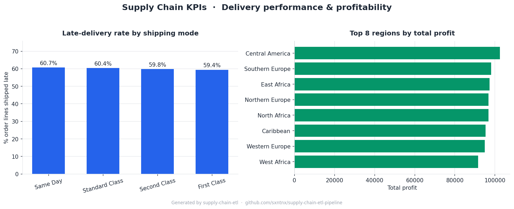

# Supply Chain ETL Pipeline

An end-to-end ETL pipeline that extracts raw supply chain data, applies data
quality transformations, and loads a normalized **star schema** into a SQLite
analytical database — ready to answer real operational questions about
delivery performance and profitability.

Built with **Python · Pandas · SQLite**

---

## Why this project

I'm an industrial engineer working in data analytics. Supply chains generate
wide, messy transactional exports that are useless for analysis until they're
cleaned and modeled. This pipeline does exactly that: it takes a raw 53-column
order export and turns it into a tidy star schema where questions like *"what's
our late-delivery rate by shipping mode?"* are a one-line SQL query.

---

## Architecture

```
data/raw/
  └── DataCoSupplyChainDataset.csv
        │
        ▼
   [extract.py]        → Load raw CSV (latin-1, 180K+ rows)
        │
        ▼
   [transform.py]      → Clean · Enrich · Split
        │
        ├── dim_customers   (unique customers)
        ├── dim_products    (unique products)
        └── fact_orders     (one row per order line)
                │
                ▼
          [load.py]         → SQLite + indexes
                │
                ▼
     database/supply_chain.db
```

---

## Transformations applied

| Step | Description |
|------|-------------|
| PII removal | Drop customer email, password, street, name fields |
| Date parsing | Parse order and ship dates to `datetime` |
| Feature engineering | `delivery_delay_days`, `is_late_delivery` |
| Text normalization | Title-case + strip city, country, product fields |
| Null handling | Fill missing zipcodes and profit values |
| Deduplication | Remove exact duplicate rows |
| Schema split | Normalize into 1 fact table + 2 dimension tables |

---

## Database schema

### `fact_orders`
| Column | Type | Description |
|--------|------|-------------|
| order_item_id | INTEGER | Primary key (order line grain) |
| order_id | INTEGER | Order identifier |
| order_customer_id | INTEGER | FK → dim_customers |
| product_id | INTEGER | FK → dim_products |
| order_date | TEXT | Order date (ISO 8601) |
| ship_date | TEXT | Shipping date (ISO 8601) |
| quantity | INTEGER | Units ordered |
| sales | REAL | Revenue |
| order_profit | REAL | Profit per order |
| delivery_delay_days | INTEGER | Actual − scheduled shipping days |
| is_late_delivery | INTEGER | 1 if late, 0 if on time |
| delivery_status | TEXT | Delivery outcome |
| shipping_mode | TEXT | Service level |
| market / order_region | TEXT | Geography |

### `dim_customers`
Unique customers with segment, city, state, country, zipcode.

### `dim_products`
Unique products with category, department, list price.

Indexes are created on the fact table's foreign keys and on `is_late_delivery`
to keep the analytical queries fast.

---

## Getting started

### 1. Clone and install
```bash
git clone https://github.com/sxntnx/supply-chain-etl-pipeline.git
cd supply-chain-etl-pipeline
pip install -r requirements.txt
```

### 2. Get the data — two options

**Option A — Real dataset (Kaggle).**
Download the [DataCo Smart Supply Chain Dataset](https://www.kaggle.com/datasets/shashwatwork/dataco-smart-supply-chain-for-big-data-analysis)
and place the CSV at `data/raw/DataCoSupplyChainDataset.csv`.

**Option B — Synthetic sample (no download).**
Generate a statistically plausible sample with the same schema so the pipeline
runs end-to-end out of the box:
```bash
python scripts/generate_sample_data.py --rows 20000
```

### 3. Run the pipeline
```bash
python main.py
```

Example run (synthetic 20K sample):
```
2026-06-11 11:56:22 | INFO     | pipeline  | Supply Chain ETL Pipeline - START
2026-06-11 11:56:22 | INFO     | pipeline  | [1/3] EXTRACT
2026-06-11 11:56:22 | INFO     | extract   | Extracted 20,020 rows x 50 columns
2026-06-11 11:56:22 | INFO     | pipeline  | [2/3] TRANSFORM
2026-06-11 11:56:22 | INFO     | transform | Removed 20 exact duplicate rows
2026-06-11 11:56:22 | INFO     | transform | dim_customers: 2,500 unique customers
2026-06-11 11:56:22 | INFO     | transform | dim_products:    400 unique products
2026-06-11 11:56:22 | INFO     | transform | fact_orders:   20,000 rows
2026-06-11 11:56:22 | INFO     | pipeline  | [3/3] LOAD
2026-06-11 11:56:22 | INFO     | load      | Database written to .../supply_chain.db
2026-06-11 11:56:22 | INFO     | pipeline  | Pipeline completed in 0.34s
```

---

## Analytics

The point of modeling the data is to query it. `sql/analytics_queries.sql`
contains the operational questions this schema was built to answer:

```bash
sqlite3 database/supply_chain.db < sql/analytics_queries.sql
```

| # | Question (KPI) |
|---|----------------|
| 1 | On-Time Delivery rate — % of order lines shipped late |
| 2 | Average delivery delay by shipping mode |
| 3 | Profitability by region (revenue vs. margin) |
| 4 | Top 10 products by revenue and their margin |
| 5 | Late-delivery rate by customer segment |

And `scripts/plot_kpis.py` renders these into a dashboard image:

```bash
python scripts/plot_kpis.py     # → reports/kpi_dashboard.png
```



---

## Project structure

```
supply-chain-etl/
├── data/raw/                   # Source CSV lives here
├── database/                   # supply_chain.db (generated)
├── src/
│   ├── extract.py              # Stage 1: load raw data
│   ├── transform.py            # Stage 2: clean, enrich, model
│   ├── load.py                 # Stage 3: write to SQLite + index
│   └── utils.py                # Logger and helpers
├── scripts/
│   ├── generate_sample_data.py # Synthetic DataCo-style data generator
│   └── plot_kpis.py            # Render KPI dashboard image
├── sql/
│   └── analytics_queries.sql   # Operational KPI queries
├── reports/
│   └── kpi_dashboard.png       # Generated KPI visuals
├── config.py                   # Paths and settings
├── main.py                     # Pipeline entry point
├── requirements.txt
└── README.md
```

---

## Key design decisions

- **Modular stages** — extract / transform / load are isolated and independently testable. Each transform step is a small pure function.
- **Config-driven** — paths, PII columns and settings live in `config.py`; no module hard-codes a path.
- **Star schema** — separating dimensions from facts keeps the fact table narrow and analytical joins cheap.
- **SQLite** — zero-infrastructure. Because persistence is isolated in `load.py`, swapping to PostgreSQL is a one-function change.
- **Reproducible** — the synthetic generator means anyone can run the full pipeline without hunting down the source data.

---

## Dataset

**DataCo Smart Supply Chain for Big Data Analysis**
Source: [Kaggle](https://www.kaggle.com/datasets/shashwatwork/dataco-smart-supply-chain-for-big-data-analysis)
~180K order records across global markets — orders, shipping, customers, products.
